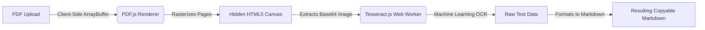

<div align="center">

# ⚡ MarkItDown
**Lightning-Fast, Local-First PDF to Markdown OCR Engine**

[](https://opensource.org/licenses/MIT)
[](https://nextjs.org/)
[](https://tailwindcss.com/)
[](https://tesseract.projectnaptha.com/)
[](#-deployment)

*Convert complex PDFs into clean, copyable Markdown entirely within your browser.*

[Live Demo](#) · [Report Bug](https://github.com/Naveenkm07/MarkItDown/issues) · [Request Feature](https://github.com/Naveenkm07/MarkItDown/issues)

</div>

---

## 🌟 Why MarkItDown?

Most PDF OCR tools rely on heavy, expensive backend servers that limit file sizes, compromise your privacy, and frequently time out. **MarkItDown flips the script.** 

By leveraging WebAssembly and Modern Web APIs, MarkItDown performs 100% of the Optical Character Recognition processing directly on your local CPU.

### Core Advantages:
- 🔒 **Absolute Privacy:** Your files are **never** uploaded to a server. Everything runs locally inside the browser memory.
- ⚡ **Edge Optimized:** Built entirely for static deployment. Since your browser handles the OCR processing, it requires zero backend compute resources.
- 🌍 **Offline Resilient:** Once the webpage and lightweight OCR models are loaded, you can disconnect from the internet and keep converting.
- 🎨 **Beautiful Developer Experience:** Features a modern, Glassmorphic UI built with Tailwind CSS and Framer Motion, fully supporting automatic Dark Mode.

---

## 🏗️ Architecture



## 🚀 Getting Started

### Prerequisites
You need Node.js 18+ installed on your local machine.

### Local Installation

1. **Clone the repository**
```bash
git clone https://github.com/Naveenkm07/MarkItDown.git
cd MarkItDown
```

2. **Install dependencies**
```bash
npm install
```

3. **Start the development server**
```bash
npm run dev
```

4. **Experience the magic**
Navigate to `http://localhost:3000` in your web browser.

---

## ☁️ Deployment

This application is fully optimized for Edge and Static deployment. 

### Deploying to Vercel (Recommended)
1. Push your code to a GitHub repository.
2. Go to the [Vercel Dashboard](https://vercel.com/dashboard) and click **Add New > Project**.
3. Import your `MarkItDown` repository.
4. Leave all build settings as default (`npm run build`).
5. Click **Deploy**.

### Deploying to Netlify
1. Go to your [Netlify Dashboard](https://app.netlify.com/).
2. Click **Add new site > Import an existing project**.
3. Select your GitHub repository.
4. Click **Deploy Site**.

---

## 💻 Tech Stack

- **[Next.js 14](https://nextjs.org/)** - React Framework for production-grade React apps.
- **[React Dropzone](https://react-dropzone.js.org/)** - For seamless, drag-and-drop file interactions.
- **[Tailwind CSS](https://tailwindcss.com/)** - Utility-first CSS framework for rapid UI styling.
- **[Framer Motion](https://www.framer.com/motion/)** - For buttery-smooth page transitions and micro-interactions.
- **[PDF.js](https://mozilla.github.io/pdf.js/)** - Robust parsing and rendering of Portable Document Formats.
- **[Tesseract.js](https://tesseract.projectnaptha.com/)** - Pure Javascript port of the popular Tesseract OCR engine.

---

## 🤝 Contributing

Contributions are what make the open source community such an amazing place to learn, inspire, and create. Any contributions you make are **greatly appreciated**.

1. Fork the Project
2. Create your Feature Branch (`git checkout -b feature/AmazingFeature`)
3. Commit your Changes (`git commit -m 'Add some AmazingFeature'`)
4. Push to the Branch (`git push origin feature/AmazingFeature`)
5. Open a Pull Request

---

## 📜 License

Distributed under the MIT License. See `LICENSE` for more information.

---
<div align="center">
  <i>Built with passion by Naveen Kumar K M</i>
</div>
